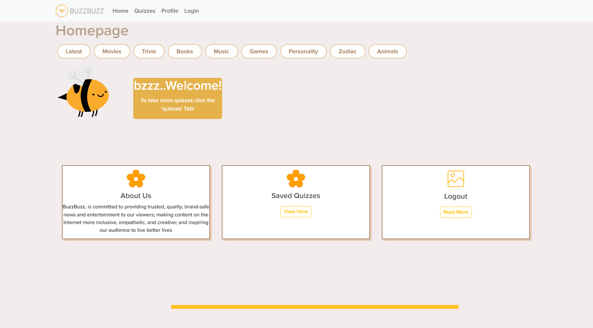

# buzzbuzz

## Description

This is a web app that lets the user take a BuzzFeed-like quiz. The user can login, take a quiz, and see their score. This program can be a base for future quiz apps since adding 
additional quizzes to the app is easy. This program was built as part of a group bootcamp project and it includes several technologies like react, express, mongodb, mongoose,
bcrypt, cookie, dotenv, fs, and jsonwebtoken.

## Installation

To install this app, download the code from this repo and open a terminal from the root of the downloaded folder. From there, enter ```npm i``` in the terminal to install all the 
required node modules (you must have node installed on your machine to do this). If you want to run the seed files so that the app precreates a quiz, users, and reviews, then run 
```npm run seed```. Once the modules/seeds are installed, enter ```npm run develop``` in the terminal to start the app. Your default web browser should automatically open with
the quiz program running from the local host server. Alternatively, you can test out the app without downloading and installing the code to your machine by visiting the live web
page here: https://buzzbuzz-bootcamp.herokuapp.com/

## Usage

The first page that appears when you start the program should be the login page. Click sign up and enter your desired username, and then your email and password into the fields. Click sign up (If you are already a registered user, then just enter your user info and click log in). You will then be brought to a page showing an overview of the app. Click on the quizzes option in the navigation bar and you will be brought to the quiz page. Here you will be presented with multiple choice questions. Click submit once you are done answering the quiz questions and you will be brought to a results page that shows your quiz score. You can click logout in the navigation bar to sign out. Here is a screenshot of the app after signing in:

    

## Credits

Julia Fritsch
Joe Shoulak
Kayla Justice
Brent Gustafson

## License

MIT License
